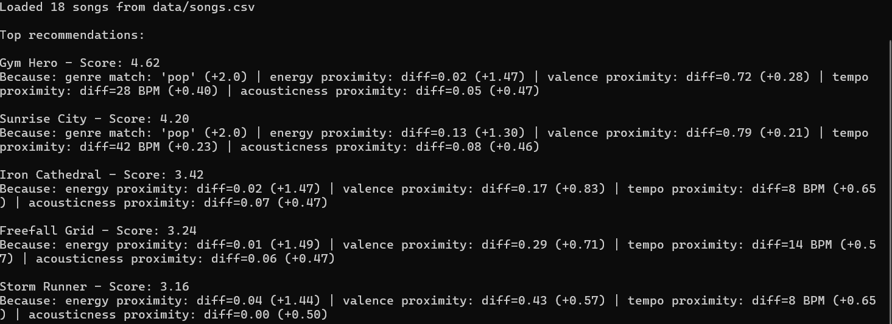
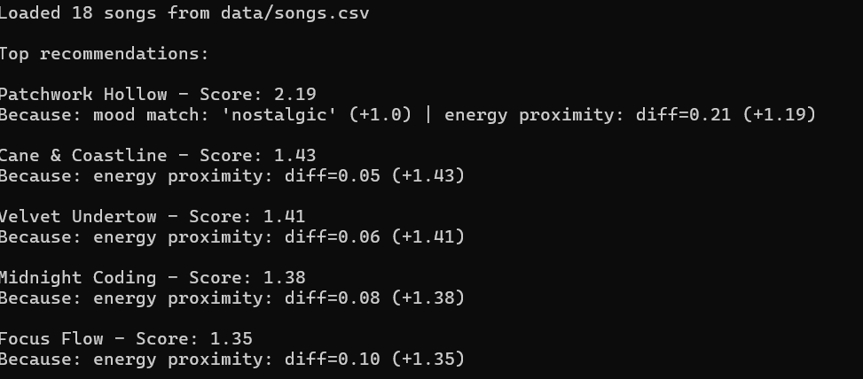
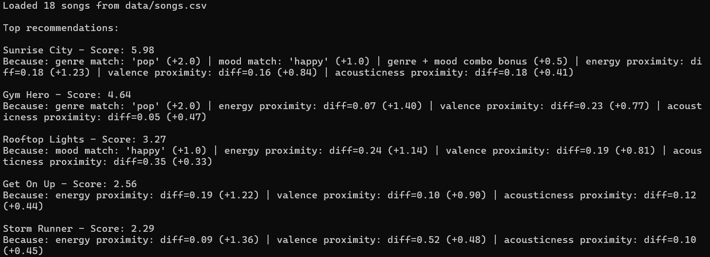

# 🎵 Music Recommender Simulation

## Project Summary

In the current version of TunesTuner 1.0, it can take the user profile and analyze the data of each of the songs to recommend it to the user using their favorite genre, mood, energy, and anything else. The system is good with giving results for users whose favorite is more common and struggle with uncommon prefrences. Tbhis reflects real world AI recommenders due to it being a struggle to find information or recommendations on topics with little information on it or real songs. 

---

## How The System Works

Explain your design in plain language.

Some prompts to answer:

- What features does each `Song` use in your system
  - For example: genre, mood, energy, tempo
- What information does your `UserProfile` store
- How does your `Recommender` compute a score for each song
- How do you choose which songs to recommend

You can include a simple diagram or bullet list if helpful.

The features in each song use in the system is all of them, each freature has a different max points to them to balance recommendations such:
- Energy: 25 points
- Valance: 20 points
- Danceability: 15 points
- Acousticness: 15 points
- Genre: 15 points
- Mood: 10 points

Information stored for UserProfile is related to those values shared above, calculated to what the User prefers like Energy is calculated to be 66%, the genre that gets the most points is rock, and mood that score the most points is intense. 

The Recommender compute a score by comparing it's features and comparing it to the user's preferences. The closer it matches, the higher the score is. The song with the highestscore gets recommended.

Algorith Recipe

Step 1 — Collect user preferences
Ask the user for a target genre, mood, and numeric values for energy, valence, tempo, and acousticness.
Step 2 — Load the song list
Read every song from songs.csv into memory.
Step 3 — Score each song
For every song, calculate a score from scratch:

If the genre matches → add 2.0 points
If the mood matches → add 1.0 point
For energy, valence, and acousticness → the closer the song's value is to the target, the more points it earns (up to the field's max weight). A perfect match gives full points; a total mismatch gives zero.
For tempo → same proximity logic, but the tolerance window is wider (±60 BPM feels natural vs. ±1.0 for a 0–1 scale).
If both genre AND mood matched → add a 0.5 combo bonus on top.

Step 4 — Sort and return
Sort all songs by score, highest first. Return the top K results.

Expected Biases
 Genre dominates too heavily. At +2.0 points, a genre match is worth more than a perfect energy + valence combined. A mediocre genre match will almost always beat a song that fits the vibe perfectly but sits in a neighboring genre (e.g. jazz vs. soul).

 Mood is binary and blunt. "Chill" either matches or it doesn't — there's no partial credit for a song that's mostly chill. Two songs tagged differently could feel identical to a listener.

 Small datasets amplify genre clustering. With only ~18 songs visible, certain genres appear once or twice. A user asking for "fox" or "drum and bass" gets almost no competition within their genre, so score differences come entirely from numeric fields — which may not reflect what the user actually wants.

 Numeric fields assume the user knows their targets. Most people don't think "I want energy 0.82." If a user guesses loosely, proximity scoring rewards songs that happen to be numerically close, not songs that feel right.

  The combo bonus slightly double-counts. Genre and mood are already scored individually — rewarding their co-occurrence again nudges the algorithm toward songs that are safe and predictable rather than interestingly adjacent.


---

## Getting Started

### Setup

1. Create a virtual environment (optional but recommended):

   ```bash
   python -m venv .venv
   source .venv/bin/activate      # Mac or Linux
   .venv\Scripts\activate         # Windows

2. Install dependencies

```bash
pip install -r requirements.txt
```

3. Run the app:

```bash
python -m src.main
```

### Running Tests

Run the starter tests with:

```bash
pytest
```

You can add more tests in `tests/test_recommender.py`.

---

## Screenshots from Tests

Screenshot from Phase 3:


Screenshots form Phase 4:

High Energy + Sad Mood: 


All Optional Fields, Nothing Matches: 


Tuned to Hit Every Bonus:


Conflicting Proximity:


## Experiments You Tried

Use this section to document the experiments you ran. For example:

- What happened when you changed the weight on genre from 2.0 to 0.5
- What happened when you added tempo or valence to the score
- How did your system behave for different types of users

Before the change, genre was the dominant signal worth +2.0, meaning the system essentially filtered by genre first and used energy as a tiebreaker. After halving genre to +1.0 and doubling energy to +3.0, the roles flipped — a song in the wrong genre but with perfectly matching energy can now outscore a genre match with slightly off energy. This disproportionately affects minimal profile users, since energy now accounts for 3.0 out of their possible 5.5 points, making the recommender functionally an energy matcher for them. Niche users with rare genre labels are paradoxically the least affected, since they were already rarely earning the genre bonus to begin with. The key takeaway is that one number change shifted the system's entire recommendation philosophy from genre-first to energy-first.

---

## Limitations and Risks

Summarize some limitations of your recommender.

Examples:

- It only works on a tiny catalog
- It does not understand lyrics or language
- It might over favor one genre or mood

You will go deeper on this in your model card.

It only works on a tiny catalog and it doesn't under the songs meanings, lyrics, or other factors causing inappropriate results along with ignoring users who are in the middle tempo or otherwise. 

---

## Reflection

Read and complete `model_card.md`:

[**Model Card**](model_card.md)

Write 1 to 2 paragraphs here about what you learned:

- about how recommenders turn data into predictions
- about where bias or unfairness could show up in systems like this

The recommender uses two sets of data. The first is the data from the songs, the second is the data from the user profile. Using the user profile, the recommender tries to match the best song to the user's preferences. Certain unfairness can come from a system like this is when a user has a variety of taste or a niche taste that the recommender can't find a match to. 

---

## 7. `model_card_template.md`

Combines reflection and model card framing from the Module 3 guidance. :contentReference[oaicite:2]{index=2}  

```markdown
# 🎧 Model Card - Music Recommender Simulation

## 1. Model Name

TunesTuner 1.0

---

## 2. Intended Use

- What is this system trying to do
- Who is it for

This system is based on the song recommendation from spotify and youtube music, trying to combine best of both aspects of those systems. This a test version is for classroom exploration. 

---

## 3. How It Works (Short Explanation)

Describe your scoring logic in plain language.

- What features of each song does it consider
- What information about the user does it use
- How does it turn those into a number

Try to avoid code in this section, treat it like an explanation to a non programmer.

The features of each song used is genre, mood, energy along with a few optional fields to used to compare to a user's profile. The top five is chosen based on how well it matched the user's profile with number one, almost perfectly matching the profile.  

---

## 4. Data

Describe your dataset.

- How many songs are in `data/songs.csv`
- Did you add or remove any songs
- What kinds of genres or moods are represented
- Whose taste does this data mostly reflect

There are 18 total songs in songs.csv, I added eight new songs to the data set. There is pop, lofi, rock, ambient, jazz, synthwave, indie pop,  soul, aggressive, classical, reggae, blues, funk, and drum and bass. The moods represented is happy, chill, intense, chill, relaxed, moody, focused, melanocholic, aggressive, serene, uplifting, nostalgic, uplifting. The taste does this data mostly reflect a variety of people, but mainly younger people. 


---

## 5. Strengths

Where does your recommender work well

You can think about:
- Situations where the top results "felt right"
- Particular user profiles it served well
- Simplicity or transparency benefits


The system does well with users types with high and low energy along with favorite genres or moods being pop and happy. This is because the songs in the data tend to be happy or pop songs with more extreme ends of the energy scale although it does work with the other types of data, just the results might not be accurate. 

User profiles with favorite genre being pop and favorite mood happy with all of the optional fields tend to get the best results from the system. 

---

## 6. Limitations and Bias

Where does your recommender struggle

Some prompts:
- Does it ignore some genres or moods
- Does it treat all users as if they have the same taste shape
- Is it biased toward high energy or one genre by default
- How could this be unfair if used in a real product

The system struggles with figuring out middle users, extreme users are rewarded because songs cluster near their ceiling. Optional fields because very split in the system due to the users without the optional fields tend to be at the disadvange. Also acousticness has almost no voice in the system due to the fields along with some genres having more options than others. Overall a messy system that is unfair to people with a variety of tastes as it struggles to come up with recommendations for it. 

---

## 7. Evaluation

How did you check your system

Examples:
- You tried multiple user profiles and wrote down whether the results matched your expectations
- You compared your simulation to what a real app like Spotify or YouTube tends to recommend
- You wrote tests for your scoring logic

You do not need a numeric metric, but if you used one, explain what it measures.

The types of user profiles I tested was mostly edge cases such as high energy and sad mood profile, all of the optional fields don't match, tuned to hit every bonus, and conflicting personality. I looked to push the recommendation system hard and it resulted in mainly pop songs being recommeneded since the system deemed them to be the safe option to recommend to the user somelike like Spotify or YouTube would deal with since people have a variety of tastes and can be strange. 

---

## 8. Future Work

If you had more time, how would you improve this recommender

Examples:

- Add support for multiple users and "group vibe" recommendations
- Balance diversity of songs instead of always picking the closest match
- Use more features, like tempo ranges or lyric themes

If I had more time to imporve this recommender, I would go more in depth with the different songs to have a better varity instead of sticking to the user's preferences along with features such as knowing about the lyrics or language to more in line with the user's profile. 

---

## 9. Personal Reflection

A few sentences about what you learned:

- What surprised you about how your system behaved
- How did building this change how you think about real music recommenders
- Where do you think human judgment still matters, even if the model seems "smart"

I was surprised how straightforward and quick the system came to a decision despite the changes in the user profile tested, showing some kind of result. Making a music recommender myself, it pulled away the magic of a music recommender as it boilded down to figuring out my favorite genre, mood, energy, and even tempo to best recommend me songs I would like. 

Human judgement still matters because even if a model seems "smart", it only looks at the raw data of a song. It doesn't understand the complexity of a song and how it makes a human feel. 